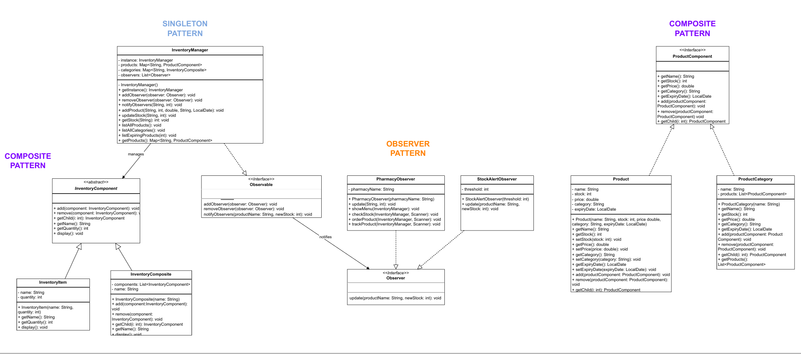

# Akdeniz Pharmaceutical Warehouse (APW)

## Introduction
Akdeniz Pharmaceutical Warehouse (APW) is a software solution designed to optimize inventory management for pharmacies and a central pharmaceutical warehouse. It enables efficient stock tracking, automated alerts, and streamlined communication between pharmacies and the warehouse.

## Features

### Central Warehouse Functionalities:
- **Add Product**: Add new medications to the inventory.
- **Update Stock**: Modify stock levels for existing medications.
- **List Products**: Display all medications with details such as stock levels and expiration dates.
- **Remove Product**: Remove discontinued or unused medications.
- **Stock by Category**: Organize and view medications by categories.
- **Stock by Product**: Search for and view details of specific medications.
- **Expiring Products**: Highlight medications nearing expiration.

### Pharmacy Functionalities:
- **Check Stock**: View up-to-date stock levels.
- **Order Product**: Place restocking orders directly to the warehouse.
- **Track Product**: Monitor the status of ordered medications.

## Design Patterns Used
1. **Composite Pattern**:
   - Organizes medications into hierarchical categories (e.g., "Antibiotics," "Pain Relievers").
   - Simplifies inventory navigation and management.

2. **Observer Pattern**:
   - Ensures real-time notifications for stock changes.
   - Keeps pharmacies and the warehouse synchronized on stock levels.

3. **Singleton Pattern**:
   - Maintains a single instance for critical components like the inventory database.
   - Prevents duplicate data and ensures consistency across the system.

## UML Diagram
The APW system architecture is defined with a robust UML design, showcasing:
- **Interfaces**: Observable, Observer, ProductComponent.
- **Key Classes**: InventoryManager, PharmacyObserver, StockAlertObserver, Product, InventoryComposite.

Below is the UML diagram representing the architecture of APW:



## Real-World Applications
- **Efficiency**: Automated processes reduce manual work for pharmacies.
- **Customer Satisfaction**: Ensures essential medications are always in stock.
- **Cost Savings**: Avoids stockouts and emergency delivery costs.

## Installation
1. Clone the repository:
   ```bash
   git clone https://github.com/emirhandumann/inventory_management_system.git
   ```
2. Navigate to the project directory:
   ```bash
   cd inventory_management_system
   ```
3. Compile the project:
   ```bash
   javac -d bin src/**/*.java
   ```
4. Run the application:
   ```bash
   java -cp bin Main
   ```

## Contributors
- **Emirhan Duman**
- **İsmail Babacan**
- **Ahmet Faruk Tekeli**
